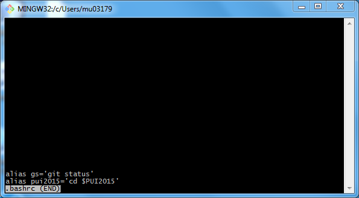
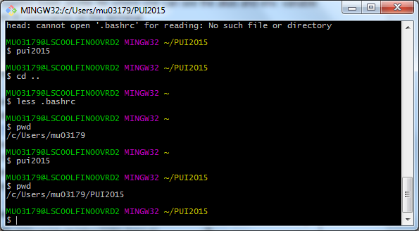

# PUI2015_murbanek

I was unsuccessful in creating the environment variable and bash profile per the homework instructions.  This seems to be due to using the bash on Windows. 

Instead I edited the environment variable using the Windows tools (System Properties) and found a guide for editing the .bashrc file here:

http://superuser.com/questions/602872/how-do-i-modify-my-git-bash-profile-in-windows

Here are the screenshots of the successful commands:

